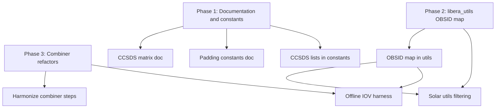

# Calibration Tier 1 — follow-up plan

This document captures deferred work from [libera_rad PR #17](https://github.com/LASP-Libera/libera_rad/pull/17) (Tier 0 combined calibration products). Tier 0 delivers manifest-driven combiners (`GAIN-COMBINED`, `LW-TEMP*-COMBINED`, `SW-COMBINED`, `SOLAR-FACE*-COMBINED`) with integration-test coverage. Tier 1 improves correctness, shared utilities, operability, and ICD-aligned documentation.

**Baseline (Tier 0):** `libera_rad.calibration.combiners` — `gain_combiner`, `lw_cal_combiner`, `sw_combiner`, `solar_cal_combiner`, `l1a_combine`, `l1a_cal_event_utils`. Offline `run_*_cal_event` scripts removed; depends on `libera-utils >= 5.8.1`.

---

## Goals

1. **Single sources of truth** for OBSID semantics, CCSDS merge rules, and padding constants across `libera_rad` and `libera_utils`.
2. **Consistent combiner structure** so gain, SW, LW, and solar pipelines share the same staged workflow (LW combiner as template).
3. **Testable offline/IOV workflows** without ad-hoc runner scripts — detection and manifest prep live in utils or documented fixtures.
4. **ICD-justified merge behavior** for `merge_l1a_decoded_datasets` (explicit keep/drop/prefix matrix).

---

## Scope by repository

| Repo | Tier 1 touchpoints |
|------|-------------------|
| `libera_utils` | Central OBSID maps; optional filter/window APIs; shared padding defaults; NetCDF/engine docs |
| `libera_rad` | Combiner refactors; `l1a_combine` documentation; solar filtering via utils |
| `libera_cdk` / pipeline | Wire tier-0 product IDs into Step Functions / manifests (if not already done outside this PR) |

---

## Work items

### 1. Document CCSDS keep / drop / auto-prefix rules

| Field | Detail |
|-------|--------|
| **Reviewer** | mmaclay |
| **Motivation** | `CCSDS_DROP_FIELDS` in `l1a_combine.py` came from trial-and-error; Tier 1 needs ICD or packet-definition justification for each dropped and prefixed field. |
| **Deliverable** | Table in developer docs + inline module doc listing: field name, APIDs affected, drop vs keep vs prefix, rationale. |
| **Acceptance** | Science/ICD sign-off; no unexplained `REUSABLE_SPARE_*` entries. |
| **Dependencies** | None |

**Links:** [PR discussion](https://github.com/LASP-Libera/libera_rad/pull/17#discussion_r3350645366), [PR discussion](https://github.com/LASP-Libera/libera_rad/pull/17#discussion_r3350659989)

---

### 2. Central OBSID → event / face map in `libera_utils`

| Field | Detail |
|-------|--------|
| **Reviewer** | c-poling |
| **Motivation** | `OBSID_TO_FACE_IDENTIFIER` in `solar_cal_combiner.py` is useful but local; LW/gain OBSIDs should share one registry. |
| **Deliverable** | Constants or small module in `libera_utils` (e.g. solar face 384–395, LW temp OBSIDs, gain OBSIDs) with `DataProductIdentifier` mapping. |
| **Acceptance** | `libera_rad` combiners import maps from utils; unit tests in utils. |
| **Dependencies** | None (blocks item 3) |

**Links:** [PR discussion](https://github.com/LASP-Libera/libera_rad/pull/17#discussion_r3350157591)

---

### 3. Solar NOM-HK filtering via utils API

| Field | Detail |
|-------|--------|
| **Reviewer** | c-poling |
| **Motivation** | Solar combiner uses `np.isin` for face OBSIDs; utils may offer consistent time/OBSID filtering. |
| **Deliverable** | Utils function accepting OBSID set or face id; solar combiner calls it instead of inline mask. |
| **Acceptance** | Behavior unchanged on integration fixtures; supports non-base OBSIDs per face (385–387, etc.). |
| **Dependencies** | Item 2 |

**Links:** [PR discussion](https://github.com/LASP-Libera/libera_rad/pull/17#discussion_r3350173216)

---

### 4. Harmonize combiner step structure

| Field | Detail |
|-------|--------|
| **Reviewer** | mmaclay |
| **Motivation** | LW combiner documents clear Steps 1–7; gain/SW/solar differ (solar has extra attribute steps). |
| **Deliverable** | Shared step outline or small internal helpers: read manifest → load data → detect event type → merge → write product → output manifest. |
| **Acceptance** | All four combiners follow the same numbered steps in logs; shared code where identical. |
| **Dependencies** | Optional: item 2 |

**Links:** [PR discussion](https://github.com/LASP-Libera/libera_rad/pull/17#discussion_r3350684299)

---

### 5. Event detection and padding for offline / IOV workflows

| Field | Detail |
|-------|--------|
| **Reviewer** | mmaclay |
| **Motivation** | Deleted Tier 0 runners performed NOM-HK scan, pass grouping, and pre-windowed file writes for solar IOV testing. |
| **Deliverable** | Either utils CLI/helpers for detection + manifest generation, or documented pytest fixtures that produce valid input manifests from `tests/test_data/cal_l1a_data/`. |
| **Acceptance** | Reproduce solar multi-face/pass outputs without copying runner logic back into `libera_rad`. |
| **Dependencies** | Items 2, 3 (for solar) |

**Links:** [PR discussion](https://github.com/LASP-Libera/libera_rad/pull/17#discussion_r3350928835)

---

### 6. Shared padding constants (60 s vs 5 min)

| Field | Detail |
|-------|--------|
| **Reviewer** | c-poling |
| **Motivation** | `filter_files_by_time_window` defaults to 60 s; solar `DEFAULT_PAD` is 5 min — different purposes, easy to confuse. |
| **Deliverable** | Named constants in utils or `libera_rad.calibration.constants` with docstrings: file-selection pad vs event-window pad. |
| **Acceptance** | Combiners and utils reference named constants; developer doc explains when to use each. |
| **Dependencies** | None |

**Links:** [PR discussion](https://github.com/LASP-Libera/libera_rad/pull/17#discussion_r3350148081)

---

### 7. Move `CCSDS_*` lists to `calibration/constants`

| Field | Detail |
|-------|--------|
| **Reviewer** | c-poling |
| **Motivation** | Keep/drop lists are module-level in `l1a_combine.py`; centralizing aids reuse and Tier 1 documentation (item 1). |
| **Deliverable** | `CCSDS_KEEP_FIELDS` / `CCSDS_DROP_FIELDS` in `libera_rad/calibration/constants.py`. |
| **Acceptance** | `l1a_combine` imports constants; tests unchanged. |
| **Dependencies** | Can pair with item 1 |

**Links:** [PR discussion](https://github.com/LASP-Libera/libera_rad/pull/17#discussion_r3350048467)

---

## Suggested phasing

1. **Phase 1** — Items 1, 6, 7 (low risk, clarifies merge contract).
2. **Phase 2** — Items 2, 3 (utils API; unblocks cleaner solar combiner).
3. **Phase 3** — Items 4, 5 (structure and offline ergonomics).

---

## Out of scope (Tier 2+)

- L1B radiance algorithm changes unrelated to calibration combine products.
- Full pipeline/CDK deployment for calibration (beyond manifest/product ID wiring).
- Camera calibration products.
- Replacing `h5netcdf` / `smart_open` stack (Tier 0 already aligns with `libera_utils` defaults).

---

## NetCDF / S3 note (Tier 0 reference)

`libera_utils` defaults to `XARRAY_NETCDF_ENGINE=h5netcdf`. **S3 works** when using `smart_open` or `AnyPath.open()` file handles with `h5netcdf`; **netcdf4** does not support file-like objects or direct `s3://` URIs. Calibration integration helpers should use `NetcdfEngine.get_from_config()` and the same branching as `write_libera_data_product`.

---

## References

- PR #17: https://github.com/LASP-Libera/libera_rad/pull/17
- Tier 0 combiner package: `libera_rad/calibration/combiners/`
- Integration tests: `tests/integration/test_calibration/`
- `libera_utils` NetCDF: `libera_utils/io/netcdf.py`, `tests/unit/test_io/test_netcdf.py`
